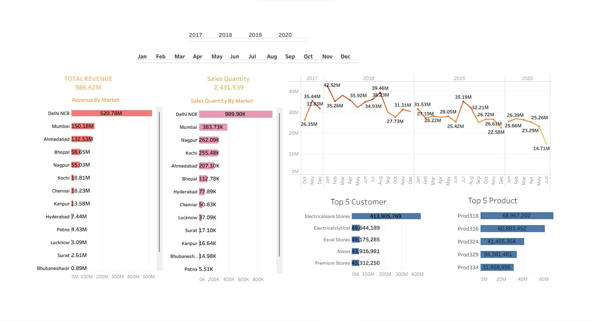

# Sales Analytics Dashboard (Tableau + MySQL)

A data-driven sales dashboard built to improve reporting efficiency and support business decision-making.

## 📌 Project Overview
This project focuses on analyzing sales data of a hardware IT company using Tableau and MySQL. The goal was to replace manual Excel-based reporting with a centralized dashboard for better decision-making.

## 🎯 Problem Statement
Sales data was scattered across multiple Excel files, making it difficult for the Sales Head to track performance and identify trends.

## 💡 Solution
Developed an interactive dashboard that provides:
- Revenue analysis
- Sales trends over time
- Market-wise performance
- Customer insights

## 🛠️ Tools Used
- Tableau (Data Visualization)
- MySQL (Data Extraction & Analysis)

## 📈 Key Insights
- Delhi NCR contributed the highest revenue
- Sales showed a decline in 2020
- Few customers contributed major revenue
- Some regions showed low performance (growth opportunity)

## 🚀 Outcome
Improved reporting efficiency and enabled faster, data-driven decision-making.

## ⚠️ Note
This project uses simulated data for learning purposes.
